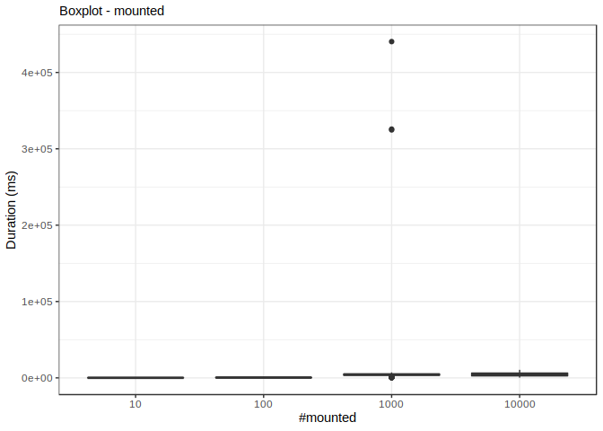
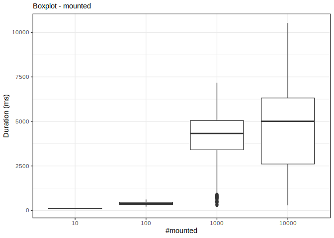
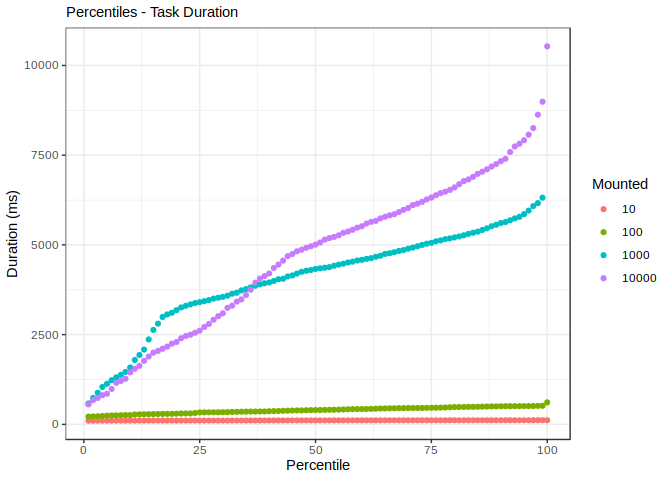

``` r
data <- read_csv(here::here('analysis', 'data', 'mount.csv'), na = c("", "NA", "NaN"))
```

    ## Parsed with column specification:
    ## cols(
    ##   mounted = col_double(),
    ##   id = col_double(),
    ##   time = col_double()
    ## )

``` r
data <- transform(data, mounted = as.factor(mounted))
```





    ## Warning: funs() is soft deprecated as of dplyr 0.8.0
    ## please use list() instead
    ## 
    ##   # Before:
    ##   funs(name = f(.))
    ## 
    ##   # After: 
    ##   list(name = ~ f(.))
    ## This warning is displayed once per session.


